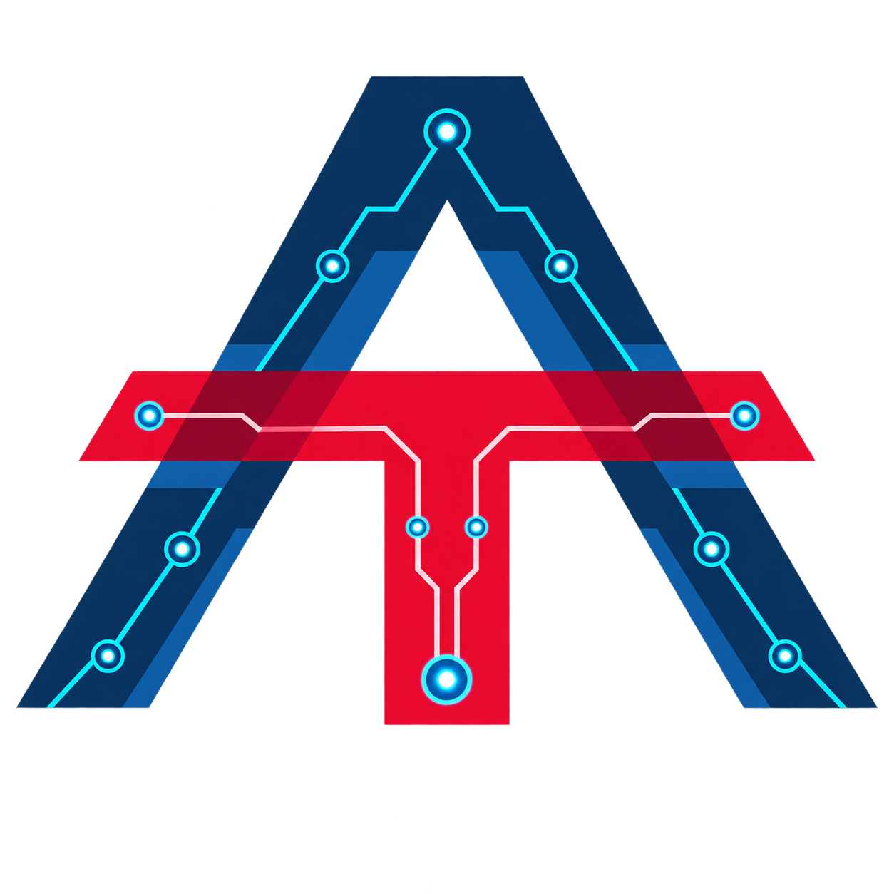
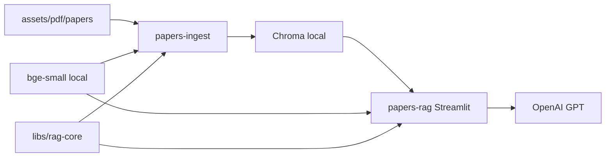

<h1 align="center"><em>amir</em>: My AI Portfolio</h1>

<p align="center">
  
</p>

<p align="center">
  <strong>Production systems I shipped — rebuilt lean, still the real stack.</strong>
</p>

<p align="center">
  <a href="https://github.com/amirhessam88/amir/actions/workflows/ci.yml"></a>
  <a href="https://github.com/amirhessam88/amir/actions/workflows/docs.yml"></a>
  <a href="https://codecov.io/gh/amirhessam88/amir"></a>
  <a href="https://pypi.org/project/amir/"></a>
  <a href="https://www.python.org/downloads/"></a>
  <a href="LICENSE"></a>
  <a href="https://amirhessam88.github.io/amir/"></a>
</p>

AI portfolio monorepo: shared libs, Streamlit apps, ingest jobs, and a docs super-app. An open-source-first RAG stack over my research papers, with `uv` workspaces and an enforceable import DAG — the same shapes I shipped in production, smaller so you can see the wiring.

## ✨ What’s inside

| Path                                                | Product                                            | Docs                                                                |
| --------------------------------------------------- | -------------------------------------------------- | ------------------------------------------------------------------- |
| [`libs/rag-core`](libs/rag-core/)                   | LlamaIndex + Chroma + local embeddings + citations | [rag-core](https://amirhessam88.github.io/amir/rag-core/)           |
| [`projects/papers-ingest`](projects/papers-ingest/) | PDF → vector index CLI                             | [papers-ingest](https://amirhessam88.github.io/amir/papers-ingest/) |
| [`apps/papers-rag`](apps/papers-rag/)               | Streamlit query chat                               | [papers-rag](https://amirhessam88.github.io/amir/papers-rag/)       |



Topology is strict: `apps/` and `projects/` may depend on `libs/` only. Full DAG and ADRs live in the [architecture portal](https://amirhessam88.github.io/amir/architecture/).

## 🚀 Quick start

```bash
uv tool install poethepoet
poe sync                      # install workspace from uv.lock
cp .env.example .env          # set OPENAI_API_KEY
poe ingest-papers             # first run downloads the embedding model
poe run-papers-rag            # open the Streamlit chat
poe docs                      # build the docs super-app into site/
```

Then open `site/index.html` — or the published hub at [amirhessam88.github.io/amir](https://amirhessam88.github.io/amir/).

## 📦 PyPI

```bash
pip install amir
```

One wheel. It bundles `rag.core`, `papers_rag`, and `papers_ingest` (APIs plus the `papers-ingest` / `papers-rag` CLIs). Not a git checkout: no docs portal, no `poe` toolchain, no paper PDFs. Leaf dirs stay workspace packages locally; they are not published on their own.

```bash
export OPENAI_API_KEY=...
export PAPERS_DIR=/path/to/pdfs
export CHROMA_DIR=/path/to/chroma
papers-ingest
papers-rag
```

Clone this repo when you want the full org (docs, PDFs, Docker, developer loop).

## 🆓 Free / OSS stack

| Layer         | Choice                           | Cost     |
| ------------- | -------------------------------- | -------- |
| Orchestration | LlamaIndex                       | OSS      |
| Embeddings    | `BAAI/bge-small-en-v1.5` (local) | Free     |
| Vector DB     | Chroma (persistent dir)          | Free     |
| LLM chat      | OpenAI API                       | Your key |
| Docs hosting  | GitHub Pages                     | Free     |

## 🧪 Quality

`poe test` gates **100%** branch coverage on `amir`, `rag.core`, `papers_rag`, and `papers_ingest`. CI runs that suite on Ubuntu and macOS across Python 3.11–3.13, then uploads `xmlcov/coverage.xml` to [Codecov](https://codecov.io/gh/amirhessam88/amir).

```bash
poe verify    # check (ruff + mypy) + test
```

Same gate CI runs. Dep upgrades: `poe upgrade` (or `poe upgrade ruff`). See [CONTRIBUTING.md](CONTRIBUTING.md).

## 📚 Docs

| Hub           | URL                                                                  |
| ------------- | -------------------------------------------------------------------- |
| Landing       | [amirhessam88.github.io/amir](https://amirhessam88.github.io/amir/)  |
| Architecture  | […/architecture/](https://amirhessam88.github.io/amir/architecture/) |
| Local preview | `poe docs` → `site/index.html`                                       |
