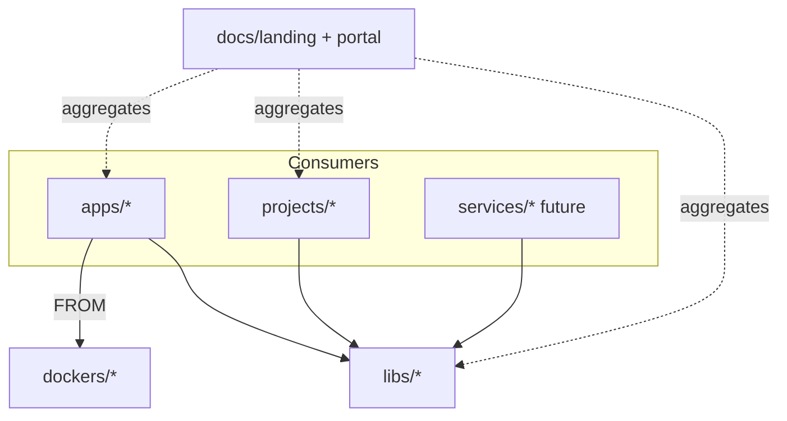

# 📁 Monorepo overview

This repository is an **org monorepo**: a versioned dependency graph with
enforceable import edges, one toolchain contract, and a docs super-app that
aggregates every product leaf.

## 📐 Topology



| Directory | Role |
|-----------|------|
| `apps/` | User-facing apps (Streamlit Papers RAG) |
| `libs/` | Shared packages (`rag-core` → `rag.core`) |
| `projects/` | Domain CLIs / batch jobs (papers ingest) |
| `services/` | Reserved for future HTTP/gRPC services |
| `tools/` | `devtools/` + `buildtools/` + `resources/` (poe entrypoints) |
| `dockers/` | Shared base images + compose |
| `docs/` | Landing hub + architecture portal |

## 🧱 Import DAG (non-negotiable)

- ✅ `apps|projects|services → libs`
- ✅ `libs → libs` only via an acyclic graph
- ❌ No app ↔ service imports
- ❌ No lib → app / project imports

## 🏷️ Naming

```text
libs/rag-core/          # distribution name (kebab)
  src/rag/core/         # import path (hyphen → /)
# from rag.core import RagConfig
```

## 📚 Docs contract

Every product leaf ships:

1. A Sphinx `docs/` node
2. A card on the matching topology hub under `docs/landing/`
   (`apps/` / `libs/` / `projects/` / `services/` / `docs/`)
3. A path prefix under the published site (`/rag-core/`, `/papers-rag/`, …)
