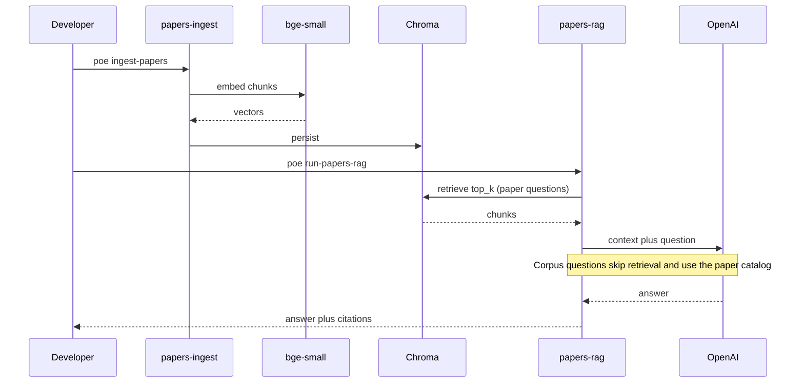

# 🧠 RAG stack (learning guide)

End-to-end flow for Papers RAG:

## 📄 PDF text

Ingest uses **pypdf** page extraction (not LlamaIndex's default file reader).
Empty pages, dedications, and figure dumps (chart axes, pyLDAvis chrome, PDF
``/uni00`` encodings) are skipped via ``is_prose_text``. Rebuild with
`poe ingest-papers` after loader or filter changes.

Query over-retrieves (`top_k × 3`) and drops non-prose chunks before the LLM.

## 📄 Chunking

`SentenceSplitter` with `chunk_size=1024` and `chunk_overlap=128` (override via
`CHUNK_SIZE` / `CHUNK_OVERLAP`). Larger chunks keep more paper context; smaller
chunks improve precision for narrow questions.

## 🧮 Embeddings (free / local)

`HuggingFaceEmbedding` + `BAAI/bge-small-en-v1.5` runs on your machine. First
ingest downloads weights from HuggingFace Hub.

## 🗄️ Vector store (free / local)

Chroma persists under `.data/chroma/papers` (gitignored). Rebuild with
`papers-ingest` (default `--rebuild`).

## 💬 LLM (your key)

Only the generative step calls OpenAI (`gpt-4o-mini` by default). Set
`OPENAI_API_KEY` in `.env` or Streamlit secrets.

## 📚 Citations

Retrieved nodes become `Citation` objects (`file_name`, `page`, `score`,
`snippet`) rendered in the Streamlit UI.

## 🗺️ Corpus questions

Questions about *all papers* (common theme, whole library) skip vector
retrieval. Ingest writes `catalog.json` next to Chroma (filename + opening
snippet per PDF). The LLM synthesizes from that full list — that is how
“applied machine learning” can emerge as the umbrella, with domains like
imaging, networks, and environment named from the files. Factoid questions
still use top-k chunks.
