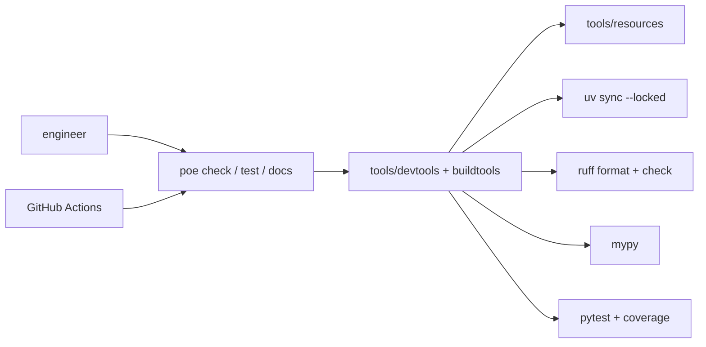

# 🧰 Toolchain

Same developer loop locally and in CI. Root `poe` tasks call files under
`tools/devtools/` and `tools/buildtools/`; configs live in `tools/resources/`.
See the **tools/** hub on the docs landing for the handbook.



```bash
uv tool install poethepoet
poe sync
poe verify
poe docs
poe ingest-papers
poe run-papers-rag
```

| Task | Purpose |
|------|---------|
| `poe sync` | Install workspace from lockfile |
| `poe lock` | Refresh `uv.lock` (no upgrades) |
| `poe upgrade` | Upgrade all (or named) deps, then sync |
| `poe verify` | Monorepo gate: check + test |
| `poe greet` | Sanity / banner |
| `poe format` | ruff format + ruff check --fix (imports) |
| `poe check` | format --check + ruff + mypy |
| `poe test` | unit tests across leaves (skips slow/API markers; 100% coverage gate) |
| `poe docs` | landing + all Sphinx leaves → `site/` |
| `poe ingest-papers` | rebuild Chroma index |
| `poe run-papers-rag` | Streamlit chat (`papers-rag` CLI) |

`pip install amir` is a single wheel (leaf code bundled inside). Set `PAPERS_DIR` / `CHROMA_DIR` / `OPENAI_API_KEY`, then `papers-ingest` / `papers-rag`. Clone the repo for docs, PDFs, and `poe`.
