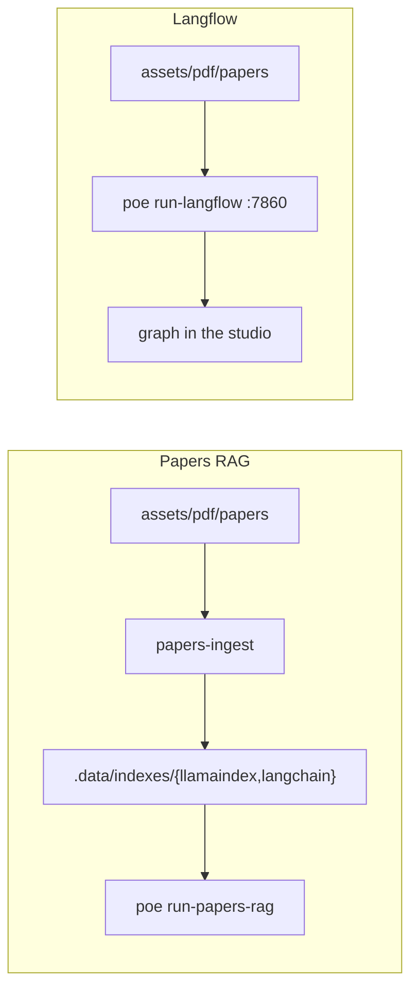

# 🌊 Langflow

Visual IDE on LangChain: drag a PDF loader, splitter, embeddings, prompt, and
LLM into a graph, then chat in Langflow’s UI. It does not read Papers RAG
indexes under `.data/indexes/`.



|            | Papers RAG                       | Langflow                          |
| ---------- | -------------------------------- | --------------------------------- |
| Role       | In-process retrieve-and-generate | Visual flow editor + HTTP server  |
| Launch     | `poe run-papers-rag`             | `poe run-langflow`                |
| Index      | `papers-ingest` → Chroma         | Authored in the studio            |
| UI         | Streamlit chat                   | http://127.0.0.1:7860             |
| Citations  | `Citation` objects from chunks   | Depends on the graph              |

LlamaIndex and LangChain share a loader, embed model, chunk size, and isolated
Chroma dirs. Langflow stores data under `.data/langflow/` and is not installed
in the workspace venv (`uv tool run --from langflow`).

## 🚀 Launch

```bash
poe run-langflow
```

Open http://127.0.0.1:7860. Point file loaders at `assets/pdf/papers`.
`OPENAI_API_KEY` comes from the repo-root `.env`. First start downloads
Langflow and can take a few minutes.

Docker:

```bash
docker compose -f dockers/compose/local-langflow.yml up
```

In the container, PDFs are at `/app/papers`.
