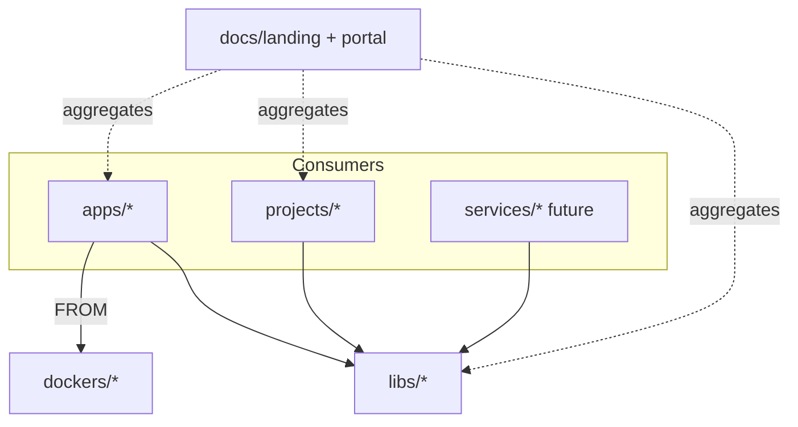

# 📁 Monorepo overview

This repository is an **org monorepo**: a versioned dependency graph with
enforceable import edges, one toolchain contract, and a docs super-app that
aggregates every product leaf.

The contract is
[Building an Org Monorepo](https://www.amirhessam.com/two-cents/building-an-org-monorepo.html):
path / editable installs inside the workspace (not version-chased internal
wheels), leaf-owned `docs/` and `ci.yml`, reusable GitHub workflows, shared
`dockers/` bases.

## 📐 Topology



| Directory | Role |
|-----------|------|
| `apps/` | User-facing apps (Streamlit Papers RAG) |
| `libs/` | Shared packages (`rag-core` → `rag.core`) |
| `projects/` | Domain CLIs / batch jobs (papers ingest) |
| `services/` | Reserved for future HTTP/gRPC services |
| `tools/` | `devtools/` + `buildtools/` + `resources/` (poe entrypoints) |
| `dockers/` | Shared base images + compose |
| `docs/` | Landing hub + architecture portal |
| `.github/` | Reusable workflows + per-leaf stubs |

`cookiecutters/` and `iac/` from the blueprint are not in this tree yet.

## 🧱 Import DAG

- ✅ `apps|projects|services → libs`
- ✅ `libs → libs` only via an acyclic graph
- ❌ No app ↔ service imports
- ❌ No lib → app / project imports

Inside the workspace, leaves depend via `[tool.uv.sources]` path deps and
`uv.lock`. External consumers can still `pip install amir`.

## 🏷️ Naming

```text
libs/rag-core/          # distribution name (kebab)
  src/rag/core/         # import path (hyphen → /)
# from rag.core import RagConfig
```

## 📚 Docs contract

Every product leaf ships:

1. A Sphinx `docs/` node
2. A card on the matching topology hub under `docs/landing/`
   (`apps/` / `libs/` / `projects/` / `services/` / `docs/`)
3. A path prefix under the published site (`/rag-core/`, `/papers-rag/`, …)

## 🧩 Leaf CI

A leaf is not only source: it owns `pyproject.toml`, tests, `docs/`, and a thin
`ci.yml`. Root `.github/workflows/` stubs `uses:` `_python-leaf.yml` with path
filters. Shared job bodies live in the parent templates, not copied into every
leaf.

(two-cents)=
## 💡 2-Cents

- [Building an Org Monorepo](https://www.amirhessam.com/two-cents/building-an-org-monorepo.html)
  — topology, path deps, leaf CI, docs portal
- [MLOps Deployment Strategies](https://www.amirhessam.com/two-cents/mlops-deployment-strategies.html)
  — serving modes, deploy-code vs deploy-model, traffic strategies
