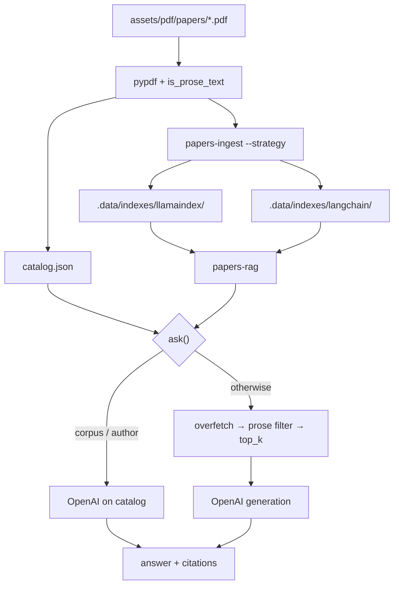
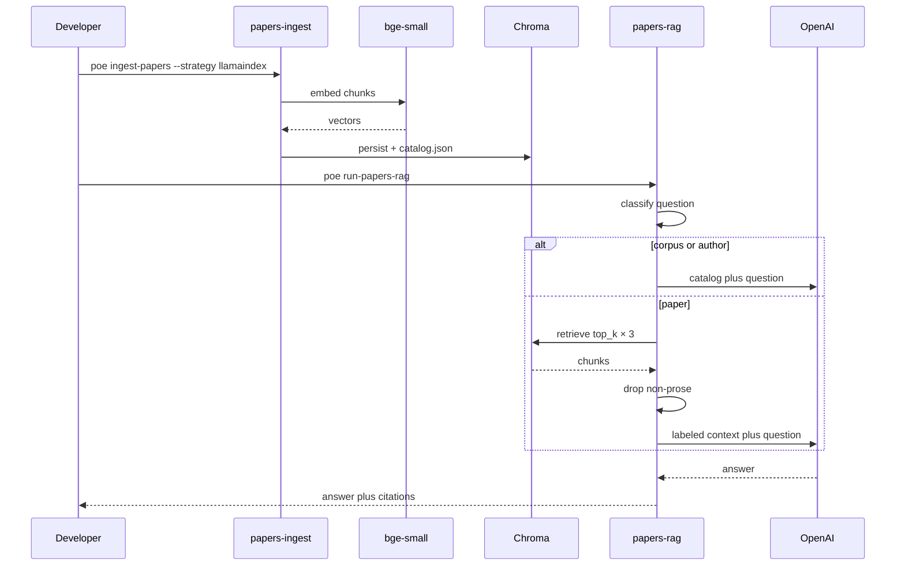
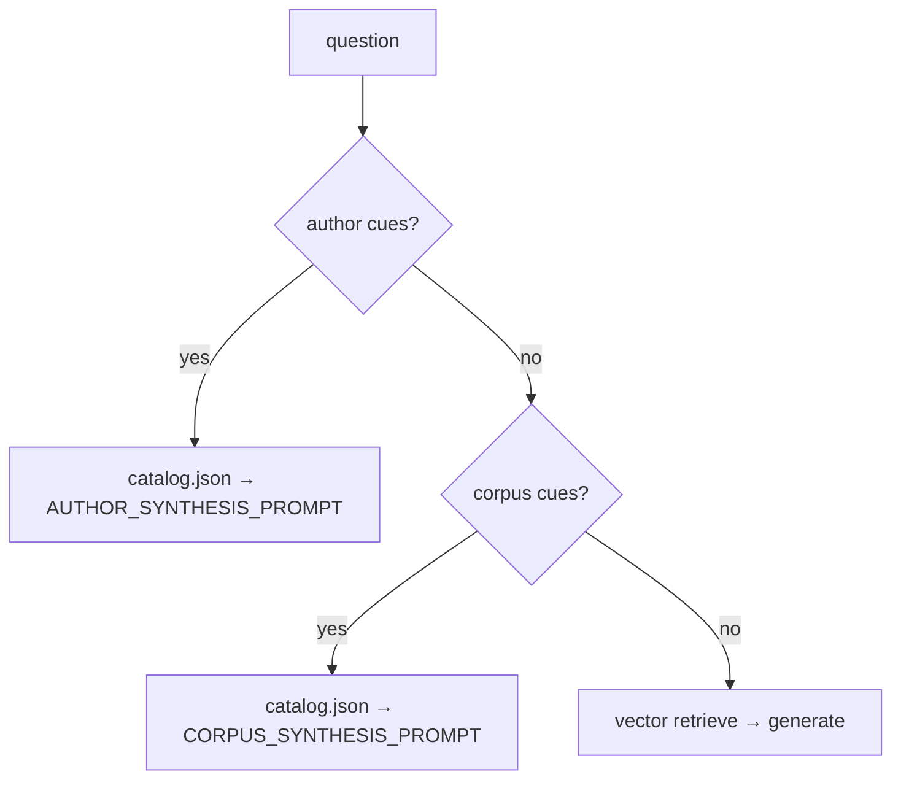

# 🧠 RAG stack

Papers RAG loads PDFs with pypdf, embeds locally, persists Chroma per backend,
and generates answers with OpenAI plus citations. LlamaIndex and LangChain are
in-process backends over the same corpus; each has its own Chroma directory.

Overlap chunking, a prose filter, and catalog routing (library-wide and
authorship questions skip vector search) sit on top of retrieve-then-generate.

| Leaf | Path | Role |
|------|------|------|
| `rag-core` | `libs/rag-core` → `rag.core` | Config, loaders, backends, `ask` |
| `papers-ingest` | `projects/papers-ingest` | CLI: PDF → Chroma + `catalog.json` |
| `papers-rag` | `apps/papers-rag` | Streamlit chat |

Docs: [rag-core](https://amirhessam88.github.io/amir/rag-core/),
[papers-rag](https://amirhessam88.github.io/amir/papers-rag/),
[papers-ingest](https://amirhessam88.github.io/amir/papers-ingest/).
Langflow is a separate studio: [Langflow](langflow.md).





## 🎛️ Strategies

| Strategy | Ingest | Query | Persist |
|----------|--------|-------|---------|
| `llamaindex` | `SentenceSplitter` → LlamaIndex `VectorStoreIndex` | Query engine + `ProseNodePostprocessor` | `.data/indexes/llamaindex/` |
| `langchain` | `RecursiveCharacterTextSplitter` → Chroma | Retriever → `ChatOpenAI` | `.data/indexes/langchain/` |

```bash
poe ingest-papers --strategy llamaindex
poe ingest-papers --strategy langchain
poe ingest-papers --strategy all
```

`--strategy all` cannot take `--chroma-dir`. `CHROMA_DIR` overrides persist for
one strategy. `RAG_STRATEGY` defaults to `llamaindex`; the Streamlit sidebar
overrides it for the session.

## 📦 Code map (`rag.core`)

| Module | Responsibility |
|--------|----------------|
| `strategy` | `RagStrategy` and `.data/indexes/{strategy}` |
| `config` | `RagConfig.from_env` — paths, models, chunking, top-k |
| `loaders` | Non-recursive `*.pdf` listing; pypdf page extraction |
| `text_quality` | `is_prose_text` (ingest + query) |
| `passage` | Author-question cues, acknowledgement / SPIE filters, page labels |
| `catalog` | `catalog.json` + corpus vs paper `QueryScope` |
| `ingest` | Dispatch + LlamaIndex chunk → embed → Chroma |
| `index` | Open persistent LlamaIndex collection; `IndexMissingError` |
| `query` | `ask()` routing, LlamaIndex engine, catalog synthesis |
| `citations` | `Citation` (`file_name`, `page`, `score`, `snippet`) |
| `backends` | `RagBackend` protocol; LlamaIndex and LangChain |

Public API: `RagConfig`, `RagStrategy`, `ingest_papers`, `ask`,
`build_query_engine`, `Citation`, `QueryResult`, `IndexMissingError`.

## 📄 PDF loading

Shared loader (`rag.core.loaders`):

- Directory: `PAPERS_DIR` or `assets/pdf/papers`.
- Non-recursive `*.pdf`, sorted by path.
- Per-page **pypdf** extraction.
- Pages that fail `is_prose_text` are skipped (empty pages, dedications, figure
  dumps, pyLDAvis chrome, PDF `/uni00` encodings).
- Metadata on kept pages: `file_name`, `file_path`, `page` (1-based),
  `page_label`.
- Image-only scans raise `FileNotFoundError`.

Rebuild with `poe ingest-papers` after loader or filter changes, then restart
Streamlit (file watching is off).

## 🧹 Prose filter

`is_prose_text` runs at ingest and again at query. A page or chunk is kept when
all of these hold:

| Check | Threshold |
|-------|-----------|
| Collapsed length | ≥ 120 characters |
| Real words (`[A-Za-z]{4,}`) | ≥ 8 |
| PDF `/uni00` encodings | rejected |
| Letter stutter (`aaaa` in a long token) | rejected |
| Tokens mixing letters with unusual symbols | < 10% of tokens |
| Glued TitleCase / camelCase | < 4% of tokens |
| Snake_case tokens | < 3% of tokens |
| Single-letter tokens | reject if ≥ 7% and fewer than 80 real words |

Query retrieves `similarity_top_k × 3` (`RETRIEVAL_OVERFETCH = 3`), then keeps
at most `similarity_top_k` prose chunks.

## ✂️ Chunking

| Backend | Splitter | Defaults |
|---------|----------|----------|
| LlamaIndex | `SentenceSplitter` | `chunk_size=1024`, `chunk_overlap=128` |
| LangChain | `RecursiveCharacterTextSplitter` | same sizes |

Override with `CHUNK_SIZE` / `CHUNK_OVERLAP`. Rebuild the index after changing
these.

## 🧮 Embeddings

LlamaIndex and LangChain both use the local model `BAAI/bge-small-en-v1.5`
(LlamaIndex: `HuggingFaceEmbedding`; LangChain: `HuggingFaceEmbeddings`). First
ingest downloads weights from HuggingFace Hub. Override with `EMBED_MODEL`.
Query-time embed must match ingest.

## 🗄️ Vector store

Chroma `PersistentClient` under `.data/indexes/{strategy}` (gitignored).
Collection name defaults to `papers` (`CHROMA_COLLECTION`). Ingest defaults to
`--rebuild` (delete and recreate). `--no-rebuild` appends.

Each ingest writes `catalog.json` next to that strategy’s Chroma dir:

```json
{
  "papers": [
    {"file_name": "example.pdf", "title": "opening-page snippet…"}
  ]
}
```

Titles are the first extractable page, collapsed, truncated to 220 characters.
If `catalog.json` is missing or invalid, `ask()` uses filenames from
`papers_dir`.

## 🧭 Query routing

`ask(question=…, config=…)` classifies before vector search:



### Author questions

Substring match on collapsed lowercase. Bare `"author"` is not a cue, so
“what did the authors conclude?” still retrieves chunks:

- `who wrote`, `who is the writer`
- `who is the author`, `who are the authors`
- `who is the main author`, `main author`, `first author`
- `corresponding author`, `list the authors`, `authors of`

Answers come from the catalog (opening-page title and author lists), not from
SPIE volume-editor footers (`edited by … Proc. of SPIE`) or acknowledgements.

### Corpus questions

- `all papers`, `all the papers`, `every paper`
- `entire corpus`, `the corpus`, `among all`, `across all`
- `common topic among`, `main topic among`, `common theme`, `unifying theme`
- `body of work`, `what do these papers`, `these papers have in common`
- `theme across`, `overall research`

When files span domains but share ML methods, the prompt names **applied
machine learning** as the umbrella, then lists domains from filenames.

### Paper questions

Similarity search. The QA prompt treats excerpts as a retrieved subset: do not
say “all papers” or “both papers” unless every filename used is listed.

## 🔎 Retrieval

1. Embed the question with the same local model.
2. Retrieve `top_k × 3` nearest chunks from that strategy’s collection.
3. Drop non-prose chunks.
4. For leftover authorship-shaped questions: drop acknowledgement text and SPIE
   boilerplate (`edited by`, `proc. of spie`, `ccc code`, `spiedigitallibrary`,
   `terms of use`); sort remaining chunks by earlier page first.
5. Keep at most `top_k` (sidebar 1–12; env default 5).
6. LlamaIndex uses `text_qa_template` + `refine_template`. LangChain labels
   chunks as `[file.pdf, p.N]`.
7. Both inject `QA_GROUNDING_RULES`: manuscript thanks are not authors; SPIE
   “edited by” names are volume editors; prefer title-page names; do not pick
   one main author for the library from a retrieval subset.

Empty collection raises `IndexMissingError`.

## 💬 LLM

Generation uses OpenAI (`gpt-4o-mini` by default, `OPENAI_MODEL`).
`OPENAI_API_KEY` is required. Streamlit also reads Cloud `secrets.toml`.
Process env wins over `.env` (`override=False`). Streamlit does not source
`.zshrc`; `load_repo_dotenv()` loads the repo-root `.env` even when cwd is the
app script directory.

## 📚 Citations

`Citation` objects render in the Streamlit **Sources** expander (collapsed):

| Field | Retrieval | Catalog (corpus / author) |
|-------|-----------|---------------------------|
| `file_name` | chunk metadata | catalog entry |
| `page` | 1-based when present | `None` |
| `score` | retriever score when present | `None` |
| `snippet` | ≤ 280 chars of chunk text | opening-page title snippet |

Markdown: `1. **file.pdf**, p.3 (score=0.812) — snippet…`

## 💬 Streamlit

`poe run-papers-rag` runs Streamlit with `--server.fileWatcherType none` so
HuggingFace vision-module probes do not spam `ModuleNotFoundError: torchvision`.
Restart after code changes.

| Control | Meaning |
|---------|---------|
| Strategy | LlamaIndex or LangChain; switching clears chat |
| Similarity top-k | Chunks kept after overfetch + filter (1–12) |
| Clear chat | Reset session messages |
| Sources | Citations expander, collapsed |

Sidebar shows LLM id, embed model, Chroma path, and whether the index is ready.

## ⚙️ Environment

Copy `.env.example` to `.env`. Do not commit real keys.

| Variable | Default | Meaning |
|----------|---------|---------|
| `OPENAI_API_KEY` | *(required)* | Chat completions |
| `OPENAI_MODEL` | `gpt-4o-mini` | Chat model id |
| `EMBED_MODEL` | `BAAI/bge-small-en-v1.5` | Local HuggingFace embed |
| `RAG_STRATEGY` | `llamaindex` | Default backend |
| `PAPERS_DIR` | `assets/pdf/papers` | PDF directory |
| `CHROMA_DIR` | `.data/indexes/{strategy}` | Persist dir (single strategy) |
| `CHROMA_COLLECTION` | `papers` | Collection name |
| `CHUNK_SIZE` | `1024` | Splitter chunk size |
| `CHUNK_OVERLAP` | `128` | Splitter overlap |
| `SIMILARITY_TOP_K` | `5` | Chunks after filter |

CLI: `papers-ingest --papers-dir` / `--chroma-dir` / `--strategy` / `--rebuild`.

## 🆓 Cost

| Layer | Choice | Cost |
|-------|--------|------|
| Orchestration | LlamaIndex or LangChain | OSS |
| Embeddings | `BAAI/bge-small-en-v1.5` (local) | Free |
| Vector DB | Chroma (persistent dir) | Free |
| LLM chat | OpenAI API | Your key |
| Docs hosting | GitHub Pages | Free |

## 🧯 Troubleshooting

| Symptom | Fix |
|---------|-----|
| Empty index / `IndexMissingError` | `poe ingest-papers --strategy <same as sidebar>` |
| Missing `OPENAI_API_KEY` | Repo-root `.env` or `export` in the same terminal |
| `ModuleNotFoundError: torchvision` | Use `poe run-papers-rag` (file watcher off) |
| Chart axes / pyLDAvis / `/uni00` in sources | Rebuild after the prose filter; restart Streamlit |
| Acknowledgements or SPIE editors named as authors | Author routing uses `catalog.json`; restart Streamlit |
| One-paper answer to an “all papers” question | Corpus cues + catalog; re-ingest to refresh `catalog.json` |
| Garbled UTF-8 snippets | Rebuild the index |
