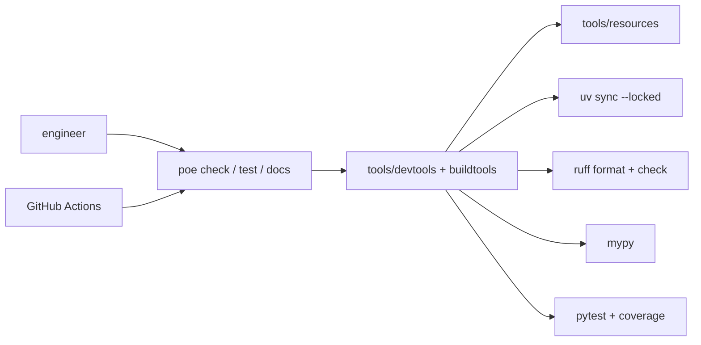

# 🧰 Toolchain

Same developer loop locally and in CI — one toolchain contract, as in
[Building an Org Monorepo](https://www.amirhessam.com/two-cents/building-an-org-monorepo.html).
Root `poe` tasks call files under `tools/devtools/` and `tools/buildtools/`;
configs live in `tools/resources/`. See the **tools/** hub on the docs landing.



```bash
uv tool install poethepoet
poe sync
poe verify
poe docs
poe ingest-papers
poe run-papers-rag
poe run-langflow
```

| Task | Purpose |
|------|---------|
| `poe sync` | Install workspace from lockfile |
| `poe lock` | Refresh `uv.lock` (no upgrades) |
| `poe upgrade` | Upgrade all (or named) deps, then sync |
| `poe verify` | Monorepo gate: check + test |
| `poe greet` | Print banner |
| `poe format` | ruff format + ruff check --fix (imports) |
| `poe check` | format --check + ruff + mypy |
| `poe test` | unit tests across leaves (skips slow/API markers; 100% coverage gate) |
| `poe docs` | landing + all Sphinx leaves → `site/` |
| `poe ingest-papers` | rebuild Chroma index (`--strategy llamaindex\|langchain\|all`) |
| `poe run-papers-rag` | Streamlit chat (`papers-rag` CLI) |
| `poe run-langflow` | Langflow studio (`uv tool run`, port 7860) |

## 📦 PyPI wheel

```bash
pip install amir
```

One wheel. It bundles `rag.core`, `papers_rag`, and `papers_ingest` (APIs plus
the `papers-ingest` / `papers-rag` CLIs). Not a git checkout: no docs portal,
no `poe` toolchain, no paper PDFs. Leaf dirs stay workspace packages locally;
they are not published on their own.

```bash
export OPENAI_API_KEY=...
export PAPERS_DIR=/path/to/pdfs
export CHROMA_DIR=/path/to/chroma
papers-ingest
papers-rag
```

Clone the repo for docs, PDFs, Docker, and `poe`.

## 🧪 Quality

`poe test` gates **100%** branch coverage on `amir`, `rag.core`, `papers_rag`,
and `papers_ingest`. CI runs that suite on Ubuntu and macOS across Python
3.11–3.13, then uploads `xmlcov/coverage.xml` to
[Codecov](https://codecov.io/gh/amirhessam88/amir). Same gate as `poe verify`.
Dep upgrades: `poe upgrade` (or `poe upgrade ruff`). See [CONTRIBUTING.md](https://github.com/amirhessam88/amir/blob/master/CONTRIBUTING.md).
