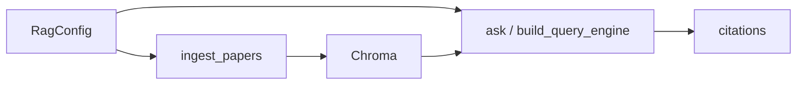

# 📦 rag-core

Shared RAG primitives for the amir AI portfolio monorepo.

```{toctree}
:maxdepth: 2
:hidden:

pages/overview
pages/quickstart
autoapi/rag/index
```

::::{grid} 1 2 2 2
:gutter: 2

:::{grid-item-card} 🧭 Overview
:link: pages/overview
:link-type: doc

Modules, strategies, routing, and env vars.
:::

:::{grid-item-card} 🚀 Quick start
:link: pages/quickstart
:link-type: doc

Ingest + ask from Python.
:::

:::{grid-item-card} 📚 API
:link: autoapi/rag/index
:link-type: doc

Auto-generated reference from numpydoc.
:::

::::


