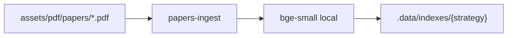

# 🧬 papers-ingest

CLI that builds the local Chroma index from `assets/pdf/papers`.

```{toctree}
:maxdepth: 2
:hidden:

pages/runbook
autoapi/papers_ingest/index
```

::::{grid} 1 2 2 2
:gutter: 2

:::{grid-item-card} ▶️ Runbook
:link: pages/runbook
:link-type: doc

Flags, rebuild vs append, and troubleshooting.
:::

:::{grid-item-card} 📚 API
:link: autoapi/papers_ingest/index
:link-type: doc

Auto-generated reference from numpydoc.
:::

::::


