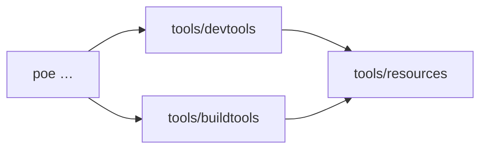

# 🧰 tools

Monorepo tool entrypoints. Root `poe` tasks call files under `devtools/` and
`buildtools/`; shared configs live in `resources/`.

```{toctree}
:maxdepth: 2
:hidden:

pages/devtools
pages/buildtools
pages/resources
```

::::{grid} 1 2 2 2
:gutter: 2

:::{grid-item-card} 🛠️ devtools
:link: pages/devtools
:link-type: doc

greet · ruff · mypy · test · tox
:::

:::{grid-item-card} 🏗️ buildtools
:link: pages/buildtools
:link-type: doc

uv sync/lock/upgrade · docs site · clean
:::

:::{grid-item-card} ⚙️ resources
:link: pages/resources
:link-type: doc

mypy · ruff · pytest · tox · coverage configs
:::

::::


